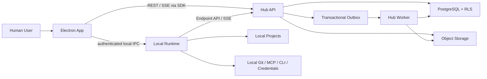

# Sartre 目标架构

> 本文解释新生产仓库的系统分工和关键调用链。当前仓库仍是 legacy MVP；图中组件和约束不代表已经实现或验证。

## 1. 先用一句话理解三个运行端

- **Hub 是公司内部的团队服务**：保存所有成员要共同看到的需求、会话、岗位任务、确认、Execution 状态、Lease、共享文件索引和审计。
- **Electron App 是每个用户的操作界面**：登录、聊天、查看整理视图、mention Agent、执行 Human Approval，并管理本机 Runtime。
- **Local Runtime 是每个用户电脑上的执行器**：只有它能访问该用户的本地目录、命令、Git、MCP 和公司网关 credential；共享 Agent 每次都在调用者 Runtime 运行。

Hub 不读取或同步整份本地代码仓库。Runtime 不决定团队状态，不能在离线时自行确认 Baseline、审批 ExecutionPlan、获得 Lease 或宣布 Requirement 完成。

架构术语中，Hub 属于 **Control Plane**，负责团队状态和治理；Runtime 属于 **Data Plane**，负责受控本地执行。Electron 同时连接两者，但不能绕过 SDK 或本地 IPC 合同直接操作内部实现。

## 2. 系统视图



图中的 Outbox 是数据库中的可靠投递工作项，不是 PostgreSQL 之外的第二份事实存储。SSE 的持久重放来源是 DomainEvent。

## 3. 数据分别保存在哪里

| 位置 | 保存内容 | 明确不保存 |
| --- | --- | --- |
| PostgreSQL 17.6 | 身份、权限、Agent/Skill/MCP 定义版本、Goal Contract Markdown/版本/确认、Message ledger、Workstream、Execution/Lease/Result 摘要、调用者私有 usage、Context、事件、审计和有保留期的脱敏 Runtime/Client 诊断。 | 本地绝对路径、业务 Secret、raw chain-of-thought。 |
| 对象存储 | 明确共享的 Attachment 正文、大文件执行报告、飞书内容快照。 | 整份本地仓库、未授权文件。 |
| Local Runtime | `bindingId -> absolutePath`、未共享代码、个人公司网关 ProviderProfile/API Key credential、CLI 登录态、临时 Codex thread/provider session、Scratchpad、Checkpoint、本地待回传队列。 | Workspace 的最终状态和 Human Approval。 |

Canonical Record 只表示 Hub 是该消息、事件或状态的唯一正式记录，不表示消息内容为真。只有 Confirmed Context 才是团队可依赖的语义约束；身份、权限、hash、cursor、Lease 等 Mechanical Fact 由程序维护。

## 4. 目标模块

| 模块 | 职责 |
| --- | --- |
| `apps/electron-app` | 登录、需求/会话/岗位任务 UI、Human Approval、Runtime 管理。 |
| `apps/local-runtime` | 每 OS 用户环境单个 companion daemon：Endpoint、Project Binding、个人 ProviderProfile、CodexAgentEngine、ToolBroker、隔离 AgentRun 和本地事件队列。 |
| `apps/hub-api` | 同步 Command/Query、认证授权、SSE、signed URL。 |
| `apps/hub-worker` | Outbox 消费、Steward、通知、Attachment 后处理和投影。 |
| `packages/domain` | 状态机、不变量和领域错误；无 Nest、DB、HTTP、Electron 依赖。 |
| `packages/contracts` | Zod DTO、Command、EventEnvelope、Result 和错误合同。 |
| `packages/sdk` | Electron/Runtime 访问 Hub 的唯一客户端，负责 auth、REST 和 SSE replay。 |
| `packages/runtime-core` | RepoRegistry、ExecutionScheduler、LeaseClient、File/Command/Git/MCP Service。 |

Electron Renderer 不直接调用 Hub；它通过 preload 具名 IPC 到 Electron main，再由 SDK 访问 Hub。Runtime 和 Electron 使用 authenticated local IPC，不能暴露原始 `ipcRenderer` 或无认证本地 HTTP 管理口。

## 5. Hub Command 事务

```text
authenticate Human / Endpoint
-> derive Workspace TenantContext
-> load resource in Workspace scope
-> authorize actor + action + resource
-> verify idempotencyKey / requestHash
-> verify expectedVersion and domain invariant
-> one transaction: state + DomainEvent + OutboxEvent + required AuditEvent
-> return success
```

只有事务提交后才能返回成功。`workspaceId`、`actorId` 或审批人不能从请求体自报成为授权依据。Worker 采用 at-least-once + 幂等消费，不宣称 exactly-once delivery。

## 6. Agent 写入链

```text
Session mention
-> route to caller Runtime
-> build ContextSnapshot
-> CodexAgentEngine creates a read-only Codex thread
-> permission-filtered read-only analysis
-> submit ExecutionPlan and file scope
-> Human Approval
-> validate LocalProjectBinding
-> acquire ProjectLease
-> open scoped write tools
-> checkpoint / heartbeat / events
-> persist ExecutionResult
-> release Lease
```

创建 AgentDefinition 只保存定义，不启动独立 Node 服务或 Codex 进程。每台设备的每个 OS 用户环境只有一个 Local Runtime daemon，由它按 Invocation 创建多个隔离 AgentRun。共享 Agent 只共享锁定版本的定义，不共享创建者 Runtime、Project 或 Key；同一 Session 多人 mention 会在各自 Runtime 并行执行。首版不允许多个 Human Account 并发共享同一 daemon；账号切换必须在 active AgentRun 停止并 reconciliation 后显式 reset/re-pair。首版工作 Agent 只使用 TypeScript `@openai/codex-sdk`；不引入 PI、LangChain、通用多 Provider Agent Loop 或第二个 Coding Agent Engine。

Codex SDK 只拥有模型推理、coding loop 和临时 thread。创建 Agent 时选择受管 model/reasoning policy；第一版允许 `gpt-5.5-2026-04-23`/`gpt-5.6-sol` 和 medium/high，默认 `gpt-5.5-2026-04-23 + high`。调用者 Runtime 使用其本地 `baseUrl + API Key` 生成隔离 ProviderProfile，文件写入、命令、Git 和 MCP 副作用统一经 Sartre MCP/ToolBroker，并在每次调用重新校验 Execution、Plan、scope、Lease/fencingToken、capability 和 CredentialRef。Runtime 将 Codex SDK event 转换为稳定 `AgentRunEvent` 并存入 `runtime_events`；它不是 DomainEvent，Hub 也不保存 Provider 私有协议、API Key 或 raw chain-of-thought。

Agent/Skill/MCP 定义发布后不可变，Invocation 锁定精确版本和 executionConfigHash。触发前检测到变更时，Hub 不启动运行，Electron 先展示 Diff 并让调用者确认最新版。运行终态且 reconciliation 完成后销毁 thread/Profile/Scratchpad，后续 Invocation 不继承 provider state。

同一逻辑 Project 同时最多一个 active Lease。首版不支持 Lease transfer；换人执行时旧 holder 先 release/revoke，新 Execution 再 acquire，并重新检查自己的本地目录和 Context。

Hub/Runtime 断线、P0 Context 变化、范围扩展、EnvironmentDrift 和 Lease 异常都在当前原子工具调用结束后暂停新的写入。恢复必须重新验证 Snapshot、Plan、Binding、Lease/fencingToken 和文件状态，不能只恢复 provider session。

## 7. Steward 处理链

```text
Message / DomainEvent / Execution / Lease
-> deterministic projector
-> Timeline / Working Set
-> optional StructuredInferencePort one-shot call
-> Zod StewardAnalysis
-> Suggested Finding / Context
-> Human confirmation or dismissal
```

每个 Session 同步创建自己的 StewardInstance。Steward 是产品层的系统 Agent 身份，但不是用户创建的工作 Agent，不运行 CodexAgentEngine 或通用 Agent Loop。机械状态、停滞、Lease 和结果缺失由确定性规则处理；只有目标漂移、跨岗位冲突、决定、放弃项和证据语义调用一次受限模型。

`StewardAnalysis` 只能形成带 sourceRefs 的 Suggested Finding/Context，不能执行工具、代替 Human 确认或改变领域状态。模型不可用时，正式消息、Timeline/Working Set、确定性检测和人工协作仍继续，仅语义建议标记 degraded。

首版语义适配器使用 Codex，每 Session 最多一个 one-shot Job；主动检测和 `@Steward` 都由 Hub Worker 使用平台专用 Steward Service Credential，不使用或回退到任何 Human 的个人 Key。服务凭据通过受管 Secret 注入，usage 归属系统并关联 workspaceId/sessionId/analysisId。2 分钟标记 delayed/degraded，5 分钟硬取消。不设用户可配置 token/费用业务预算，但保留 context window、Working Set、payload 和 debounce 上限。

## 8. 多租户与身份边界

- 全局身份表与 tenant-owned 表分离；所有 tenant-owned 表包含 `workspace_id`。
- tenant-owned 表启用 PostgreSQL RLS/FORCE RLS，Application Role 不拥有表且无 BYPASSRLS。
- Workspace Role、Project Access、Work Role 和 AgentUsagePolicy 分别授权，互不替代。
- Human Token 与 Endpoint Token 使用不同 audience 和接口；Endpoint 不能执行 Human Action。
- Agent mention 只授予共享定义的触发权。共享 Agent 在调用者 Runtime 使用其自己的 ProjectBinding 和 credential 执行，并受调用人可见性、Project Access、岗位责任和 Human Approval 限制。
- 对象存储、SSE、Cache、Queue、Rate Limit 和后台任务全部携带 Workspace Scope。

## 9. DomainEvent、Outbox 与 SSE

- DomainEvent 是 append-only 的持久业务事件，包含 Workspace 内单调且唯一的 `workspaceCursor`。
- OutboxEvent 与 DomainEvent 同事务创建，只记录 claim、attempt、nextAttemptAt 和投递结果；它不是事件事实源。
- PostgreSQL `LISTEN/NOTIFY` 只唤醒 API Pod，不承担持久化。
- 客户端使用 `Last-Event-ID` 重连，任意 API Pod 都能按已认证 Workspace 从 DomainEvent 重放。
- cursor 超出在线窗口时返回 `resync_required`，客户端读取权威 Snapshot 后重新订阅。

因此 Hub API Pod 数量、sticky session 或 Pod 内存 Subject 都不影响正确性。

## 10. Kubernetes 生产形态

```text
Internal Ingress / TLS
├── Hub API Deployment: 内部基线 1 replica，可按可用性要求扩为 2
├── Hub Worker Deployment: 至少 1 replica
├── Migration Job: 每次发布独立执行
├── PostgreSQL 17.6: 公司托管服务或 Operator，待运维确认
└── S3-compatible Object Storage
```

副本数量不改变事务、cursor、Outbox、Lease 和恢复语义。生产 Pod 使用 non-root、read-only filesystem、NetworkPolicy、不可变镜像 digest、资源限制和分层 probe；应用启动不自动执行 Migration。

## 11. 可靠性基线

- 普通 Hub/Worker 进程故障自动恢复 `<= 5 分钟`。
- 灾难场景 RPO `<= 5 分钟`，RTO `<= 60 分钟`。
- PostgreSQL PITR、对象存储 versioning、季度真实恢复演练。
- 第一版提供统一 DiagnosticContext、结构化边界日志、`ops:trace-user`/`ops:trace-correlation`、一个健康视图、基础告警和可执行 Runbook。
- 给定 userId、时间范围和现象时，工程师或 Codex 能在 10 分钟内定位最后成功步骤、首个失败步骤和稳定 errorCode。
- 完整 OpenTelemetry Span、Metric、Dashboard、成本分析和高级采样在第一版稳定后扩展。
- PostgreSQL 不可用时写入 fail closed；对象存储不可用时 Attachment 不假成功；Provider 不可用时人工协作仍可用但 Agent/Steward 明确 degraded。

这些是目标 SLO 和验收条件，不是当前已经测得的生产指标。

## 12. 当前与目标差距

当前代码包含 Workspace Token、无 Guard API、Phase/Dispatch/Delivery、多套 Artifact/Conversation、内存 SSE 和 Connector CLI。旧链路不能通过局部加字段自然变成上述生产事实链。

生产版本在新仓库重建，只按 PortingLedger 白名单移植 Electron 安全壳、通用 UI/工具配置、Role Capability、经复审的 Provider Adapter 和 Harness 原则。当前代码及历史报告仍保持 NO-GO，直到新仓库完成 MS0-MS8 并通过四层 Release Gate。
